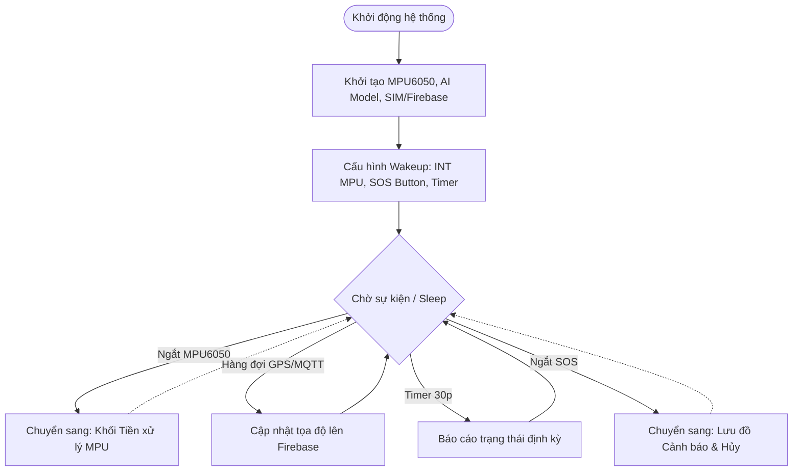
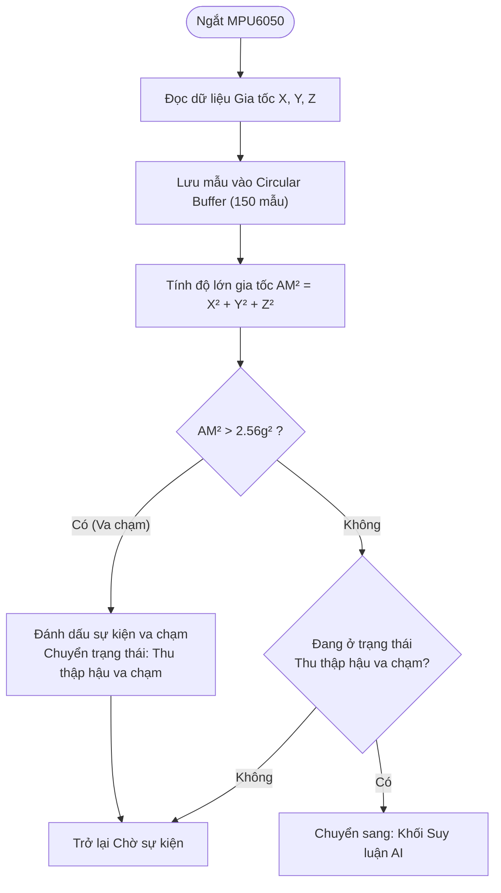
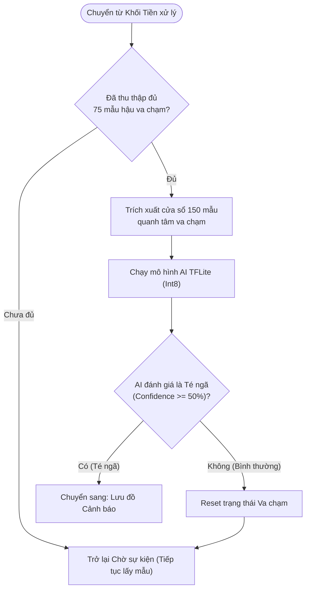
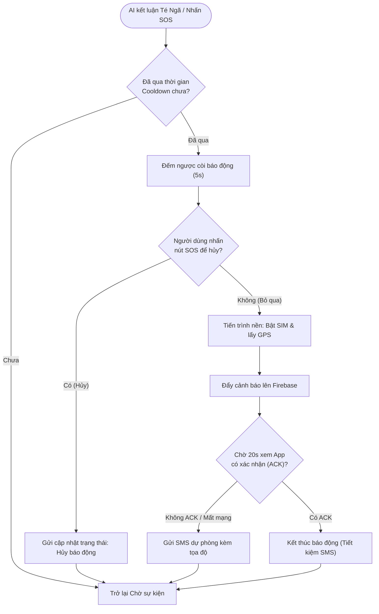

**3.5 THIẾT KẾ PHẦN MỀM**

3.5.1 Lưu đồ thuật toán

**1. Lưu đồ Hoạt động chính (Main System Flow)**

Hệ thống được phát triển bằng ngôn ngữ C/C++ trên nền tảng ESP-IDF kết hợp với hệ điều hành thời gian thực FreeRTOS, cho phép quản lý đa nhiệm và khai thác hiệu quả các tài nguyên phần cứng của ESP32. Chương trình được tổ chức theo kiến trúc app_main() và sử dụng các thư viện chuẩn của ESP-IDF như esp_log.h, esp_sleep.h, driver/gpio.h, cùng các cơ chế đồng bộ của FreeRTOS như Task, Queue, Mutex, Event Group và Timer. Để tối ưu mức tiêu thụ năng lượng, dữ liệu từ cảm biến MPU6050 không được đọc theo cơ chế thăm dò mà sử dụng ngắt phần cứng . MPU6050 được cấu hình phát tín hiệu qua chân INT mỗi khi có dữ liệu mới, đồng thời chân này được thiết lập làm nguồn đánh thức ESP32 từ chế độ ngủ . Nhờ đó, vi điều khiển chỉ thức dậy khi cần đọc dữ liệu, góp phần giảm đáng kể điện năng tiêu thụ. Tần số lấy mẫu của cảm biến được cấu hình cố định ở 25 Hz thông qua thanh ghi SMPLRT_DIV = 39, tương ứng với công thức fs=10001+39=25f_s = \\frac{1000}{1+39}=25fs​=1+391000​=25 Hz, phù hợp với tần số đã sử dụng trong giai đoạn tiền xử lý và huấn luyện mô hình AI.

Sau khi được đọc từ MPU6050, dữ liệu gia tốc ba trục (X, Y, Z) được lưu tạm vào một bộ đệm vòng có kích thước 150 mẫu, giúp duy trì liên tục cửa sổ dữ liệu mà không cần cấp phát bộ nhớ động. Trong vòng lặp chính của tác vụ , hệ thống trước tiên cấu hình các nguồn đánh thức, bao gồm ngắt từ MPU6050, nút nhấn SOS và bộ định thời dự phòng. Tiếp theo, các sự kiện bất đồng bộ như dữ liệu GPS hoặc yêu cầu báo cáo định kỳ được xử lý thông qua Queue nhằm tránh làm gián đoạn quá trình lấy mẫu. Sau khi xóa cờ ngắt của MPU6050, các mẫu gia tốc mới được đọc, tiền xử lý và ghi nối tiếp vào Circular Buffer. Hệ thống đồng thời tính toán độ lớn gia tốc theo biểu thức AM2=Ax2+Ay2+Az2AM^2 = A_x^2 + A_y^2 + A_z^2AM2=Ax2​+Ay2​+Az2​; nếu giá trị này vượt ngưỡng 2,56 g² (tương đương gia tốc khoảng 1,6 g), một sự kiện va chạm sẽ được ghi nhận. Khi đó, hệ thống tiếp tục thu thập thêm 75 mẫu (tương ứng khoảng 3 giây) để bảo đảm sự kiện va chạm nằm gần giữa cửa sổ dữ liệu gồm 150 mẫu, qua đó cung cấp đầy đủ thông tin về cả giai đoạn trước và sau va chạm cho mô hình AI. Sau khi cửa sổ dữ liệu hoàn chỉnh được tạo thành, hàm suy luận ai_model_run() được gọi để phân loại giữa hoạt động sinh hoạt tin cậy từ 50% trở lên và đã vượt qua khoảng thời gian 30 giây, hoạt động thường ngày và té ngã. Nếu mô hình xác nhận xảy ra té ngã với mức tg sẽ kích hoạt bộ đếm ngược cảnh báo bằng còi. Trong trường hợp người dùng không hủy cảnh báo thông qua nút SOS, thiết bị sẽ tự động gửi thông báo khẩn cấp, bao gồm tin nhắn, cuộc gọi và cập nhật trạng thái lên Firebase, đảm bảo người thân hoặc nhân viên chăm sóc có thể nhận được thông tin kịp thời. Nhờ quy trình xử lý theo hướng sự kiện kết hợp với cơ chế ngủ đánh thức bằng ngắt và bộ đệm vòng, hệ thống vừa đảm bảo khả năng phát hiện té ngã theo thời gian thực, vừa tối ưu hóa mức tiêu thụ năng lượng và tài nguyên bộ nhớ của vi điều khiển ESP32.

3.5.2 Cơ chế phát hiện té ngã bằng mô hình AI

**2. Khối Tiền xử lý Dữ liệu & Bắt ngưỡng Va chạm (Data Collection & Impact Detection)**

**3. Khối Chạy Suy luận AI & Đánh giá (Window Extraction & AI Inference)**

Việc suy luận mô hình trí tuệ nhân tạo được thực hiện trực tiếp trên vi điều khiển ESP32 thông qua thư viện TFLite Micro, cho phép triển khai các mô hình học sâu mà không cần hệ điều hành hoặc phần cứng tăng tốc chuyên dụng. Để phù hợp với giới hạn về bộ nhớ và năng lực tính toán của thiết bị nhúng, mô hình được lượng tử hóa xuống định dạng Int8 trước khi triển khai, giúp giảm đáng kể dung lượng lưu trữ cũng như bộ nhớ RAM trong quá trình suy luận nhưng vẫn duy trì độ chính xác gần như tương đương phiên bản Float32 đã được chứng minh ở phần thực nghiệm. Quá trình suy luận sử dụng MicroInterpreter với vùng nhớ Tensor Arena được cấp phát cố định 150 KB, trong khi các phép toán cần thiết như Conv, FullyConnected, Softmax và các toán tử liên quan được đăng ký thông qua MicroMutableOpResolver. Cách triển khai này giúp toàn bộ quá trình suy luận được thực hiện hoàn toàn trên ESP32 mà không cần kết nối tới máy chủ hay dịch vụ điện toán đám mây, đáp ứng yêu cầu xử lý thời gian thực và giảm độ trễ của hệ thống.

Đầu vào của mô hình là một tensor có kích thước \[1, 150, 3\], tương ứng với một cửa sổ dữ liệu gồm 150 mẫu gia tốc ba trục (X, Y, Z) được thu thập trong khoảng 6 giây. Trước khi đưa vào mạng nơ-ron, các giá trị gia tốc dạng số thực được chuẩn hóa theo phương pháp Min-Max Normalization nhằm đưa dữ liệu về cùng miền giá trị với quá trình huấn luyện, sau đó được lượng tử hóa sang kiểu dữ liệu int8_t để phù hợp với mô hình Int8. Sau khi hoàn thành suy luận, mô hình sinh ra tensor đầu ra có kích thước \[1, 2\], biểu diễn xác suất của hai lớp là Hoạt động sinh hoạt thường ngày (ADL) và Té ngã (Fall). Kết quả này được chuyển đổi thành cấu trúc ai_result_t, bao gồm cờ logic is_fall xác định nhãn dự đoán và giá trị confidence biểu diễn mức tin cậy của nhãn chiến thắng trong khoảng từ 0 đến 1.

Để hạn chế các cảnh báo sai, hệ thống chỉ xác nhận một sự kiện té ngã khi xác suất của lớp Fall lớn hơn lớp ADL và đồng thời độ tin cậy đạt từ 50% trở lên. Ngưỡng này được lựa chọn nhằm cân bằng giữa độ nhạy (Sensitivity) và độ đặc hiệu (Specificity) của hệ thống, tránh bỏ sót các trường hợp té ngã nhưng vẫn duy trì tỷ lệ cảnh báo giả ở mức thấp.

Khác với nhiều hệ thống phát hiện té ngã sử dụng cơ chế xác nhận trên nhiều cửa sổ dữ liệu liên tiếp, hệ thống này áp dụng cơ chế kích hoạt theo sự kiện. Trong trạng thái bình thường, ESP32 chỉ thực hiện lấy mẫu và cập nhật dữ liệu vào Circular Buffer mà không chạy mô hình AI liên tục. Chỉ khi phát hiện một va chạm vật lý có độ lớn vượt ngưỡng AM2>2,56g2AM^2 > 2,56g^2AM2>2,56g2, hệ thống mới đánh dấu thời điểm xảy ra va chạm và tiếp tục thu thập thêm 75 mẫu sau đó để hoàn thiện cửa sổ dữ liệu gồm 150 mẫu, đảm bảo sự kiện va chạm nằm gần trung tâm cửa sổ quan sát. Mô hình AI sau đó chỉ được suy luận một lần duy nhất (one-shot inference) trên cửa sổ dữ liệu hoàn chỉnh này. Nếu kết quả xác nhận là té ngã, hệ thống sẽ kích hoạt còi cảnh báo và bộ đếm ngược cho phép người dùng hủy cảnh báo. Sau mỗi lần kích hoạt, firmware áp dụng thêm khoảng thời gian 30 giây trước khi cho phép phát hiện sự kiện mới. Cơ chế này đóng vai trò giúp ngăn một cú ngã hoặc các rung động mạnh liên tiếp tạo ra nhiều cảnh báo trùng lặp, đồng thời giảm số lần suy luận AI không cần thiết, từ đó tiết kiệm năng lượng và tài nguyên tính toán của ESP32.

3.5.3 Phương pháp ước tính mức sạc pin (SOC) dựa trên điện áp pin.

Thiết bị đeo sử dụng pin Lithium Polymer (LiPo) 1 cell (1S) dung lượng 2000 mAh với điện áp danh định 3,7 V. Trong quá trình hoạt động, điện áp pin thay đổi từ khoảng 4,2 V khi được sạc đầy đến khoảng 3,0 V khi gần cạn. Để hỗ trợ người giám hộ theo dõi trạng thái hoạt động của thiết bị, hệ thống thực hiện giám sát và ước tính mức sạc pin (State of Charge - SOC), sau đó gửi thông tin này lên Firebase Firestore để hiển thị trên ứng dụng Flutter.

Mức sạc pin được ước tính dựa trên điện áp đầu cực của pin kết hợp với bảng tra cứu điện áp - dung lượng (Voltage - SOC Lookup Table). Phương pháp này có ưu điểm là đơn giản, không yêu cầu phần cứng đo dòng điện chuyên dụng, phù hợp với các hệ thống nhúng có tài nguyên hạn chế như ESP32 và đáp ứng đủ yêu cầu theo dõi mức pin của hệ thống.

Do điện áp tối đa của pin LiPo có thể đạt 4,2 V, vượt quá ngưỡng điện áp đầu vào cho phép của bộ chuyển đổi tương tự - số trên vi điều khiển, một mạch chia áp được sử dụng để đưa điện áp pin về dải đo an toàn trước khi kết nối tới chân của vi điều khiển.

Mạch chia áp gồm hai điện trở có cùng giá trị R1 = R2 = 10 kΩ được mắc nối tiếp giữa cực dương của pin và GND. Điện áp đưa vào ADC được xác định theo công thức:

VADC​=VBAT​×R1​+R2​R2​​

Với R1 = R2​, ta có:

VADC​=VBAT​×21​

Do đó điện áp pin thực được xác định theo công thức:

VBAT​=2×VADC​

Dòng điện tiêu thụ liên tục qua mạch chia áp tại điện áp pin lớn nhất 4,2 V:

I=R1​+R2​VBAT​​ =10000+100004.2​≈210μA

Giá trị dòng điện này rất nhỏ so với dung lượng pin 2000 mAh nên ảnh hưởng không đáng kể đến thời gian hoạt động của thiết bị.

Quá trình ước tính SOC được thực hiện theo ba bước:

Ở bước đầu tiên, để giảm nhiễu phát sinh từ mạch nguồn, mạch tăng áp và sai số ngẫu nhiên của ADC, hệ thống thực hiện lấy nhiều mẫu ADC liên tiếp và tính giá trị trung bình:

ADC‾=1N∑i=1NADCi\\overline{ADC} = \\frac{1}{N} \\sum\_{i=1}^{N} ADC_iADC=N1​i=1∑N​ADCi​

Trong đó N=64:

Ở bước thứ hai, giá trị ADC trung bình được hiệu chuẩn bằng thư viện ADC Calibration Driver của ESP-IDF. Theo tài liệu của Espressif, điện áp tham chiếu nội của ADC có sự sai khác giữa các chip, do đó việc hiệu chuẩn giúp nâng cao độ chính xác của phép đo điện áp. Sau khi hiệu chuẩn, giá trị điện áp đo được được nhân với hệ số của mạch chia áp để thu được điện áp pin thực tế VBATV\_{BAT}VBAT​.

Ở bước thứ ba, điện áp pin được ánh xạ sang mức SOC thông qua bảng tra cứu Voltage - SOC. Bảng này được xây dựng dựa trên đặc tuyến phóng điện tham khảo của pin Lithium Polymer 1S được công bố trong các tài liệu kỹ thuật của nhà sản xuất pin. Khi giá trị điện áp đo được nằm giữa hai điểm trong bảng tra cứu, hệ thống sử dụng phương pháp nội suy tuyến tính để tăng độ phân giải của kết quả:

SOC=SOCi+1​+Vi​−Vi+1​VBAT​−Vi+1​​×(SOCi​−SOCi+1​)

Trong đó:

Vi,Vi+1V*i, V*{i+1}Vi​,Vi+1​ là hai mức điện áp liền kề trong bảng tra cứu.

SOCi,SOCi+1SOC*i, SOC*{i+1}SOCi​,SOCi+1​ là phần trăm dung lượng tương ứng với hai mức điện áp đó.

Chức năng giám sát pin được triển khai dưới dạng một tác vụ FreeRTOS độc lập với chu kỳ cập nhật 60 giây. Để hạn chế ảnh hưởng của hiện tượng sụt áp tức thời do tải lớn, việc đo điện áp được thực hiện vào những thời điểm hệ thống không thực hiện các tác vụ tiêu thụ công suất cao như truyền dữ liệu GPS hoặc gửi dữ liệu lên Firebase.

Giá trị SOC sau khi tính toán được đóng gói cùng các thông tin trạng thái khác của thiết bị, bao gồm trạng thái té ngã, vị trí GNSS và thời gian ghi nhận, sau đó được gửi định kỳ lên Firebase Firestore thông qua kết nối mạng di động của module EG800K. Ứng dụng Flutter sử dụng cơ chế lắng nghe dữ liệu thời gian thực của Firestore để cập nhật và hiển thị mức pin hiện tại cho người giám hộ.

3.5.4 Cơ chế truyền dữ liệu cảnh báo và vị trí của hệ thống.

**4. Lưu đồ Xử lý Cảnh báo & Hủy báo động (Alert & Cancellation Logic)**

Khi hệ thống xác nhận sự kiện té ngã hoặc nhận tín hiệu SOS từ người dùng, ESP32 sẽ kích hoạt quy trình cảnh báo khẩn cấp. Quy trình này gồm hai giai đoạn chính: thu thập vị trí hiện tại từ bộ thu GNSS của module EG800K và truyền dữ liệu cảnh báo lên Firebase Firestore thông qua kết nối mạng di động.

ESP32 giao tiếp với module EG800K thông qua giao tiếp UART và sử dụng tập lệnh AT Command để điều khiển các chức năng của module. Khi cần xác định vị trí người dùng, ESP32 gửi các lệnh AT tương ứng để truy vấn thông tin định vị từ bộ thu GNSS tích hợp trong EG800K.

Module EG800K trả về dữ liệu bao gồm trạng thái định vị, vĩ độ (Latitude), kinh độ (Longitude) và thời gian định vị. ESP32 tiến hành phân tích chuỗi dữ liệu phản hồi, trích xuất các trường thông tin cần thiết để phục vụ cho quá trình cảnh báo và giám sát vị trí.

Để đảm bảo tính tin cậy của dữ liệu, hệ thống kiểm tra trạng thái định vị trước khi sử dụng tọa độ nhận được. Trong trường hợp bộ thu GNSS chưa xác định được vị trí hợp lệ hoặc tọa độ trả về không hợp lệ, hệ thống sẽ sử dụng tọa độ của lần định vị thành công gần nhất được lưu trong bộ nhớ. Cơ chế này giúp tránh việc gửi dữ liệu vị trí không chính xác và đảm bảo người giám hộ vẫn nhận được vị trí tham chiếu gần nhất của người dùng.

Sau khi thu thập được dữ liệu vị trí, ESP32 điều khiển module EG800K thiết lập kết nối dữ liệu di động và thực hiện gửi dữ liệu lên Firebase Firestore thông qua Firestore REST API. Quá trình truyền dữ liệu được thực hiện bằng các lệnh AT Command phục vụ thiết lập kết nối HTTP, cấu hình địa chỉ máy chủ và gửi dữ liệu dưới định dạng JSON.

Dữ liệu được lưu trữ dưới dạng một tài liệu trên Firestore, bao gồm các trường thông tin chính được trình bày trong Bảng 3.x.

| **Tên trường** | **Kiểu dữ liệu** | **Mô tả**                                                                      |
| -------------- | ---------------- | ------------------------------------------------------------------------------ |
| fall_detected  | Boolean          | Trạng thái phát hiện té ngã của hệ thống (True: có té ngã, False: bình thường) |
| latitude       | Double           | Vĩ độ hiện tại của người dùng thu được từ bộ thu GNSS                          |
| longitude      | Double           | Kinh độ hiện tại của người dùng thu được từ bộ thu GNSS                        |
| timestamp      | String           | Thời điểm ghi nhận sự kiện hoặc cập nhật dữ liệu                               |
| battery_pct    | Integer          | Mức dung lượng pin còn lại của thiết bị (%)                                    |

Thời gian xảy ra sự kiện được lấy từ đồng hồ thời gian thực của module EG800K, giúp đảm bảo dữ liệu cảnh báo luôn được gắn mốc thời gian chính xác trước khi gửi lên hệ thống lưu trữ.

Sau khi dữ liệu được ghi lên Firestore, ứng dụng Flutter sử dụng cơ chế lắng nghe dữ liệu thời gian thực (Realtime Listener) để tự động nhận bản cập nhật mới nhất và hiển thị thông tin cảnh báo cho người giám hộ mà không cần thao tác làm mới thủ công.

Trong một số trường hợp kết nối dữ liệu di động không khả dụng hoặc quá trình gửi dữ liệu lên Firestore thất bại nhiều lần liên tiếp, hệ thống sẽ kích hoạt cơ chế cảnh báo dự phòng bằng tin nhắn SMS.

ESP32 điều khiển module EG800K thông qua các lệnh AT Command để gửi tin nhắn đến số điện thoại của người giám hộ đã được cấu hình trước. Nội dung tin nhắn bao gồm thông báo phát hiện té ngã, thời gian xảy ra sự kiện và đường liên kết Google Maps được tạo từ tọa độ hiện tại của người dùng.

Khi nhận được tin nhắn, người giám hộ có thể mở trực tiếp liên kết Google Maps để xác định vị trí của người dùng. Cơ chế dự phòng này giúp đảm bảo thông tin cảnh báo vẫn được truyền tải ngay cả khi hệ thống không thể kết nối tới máy chủ Firestore, từ đó nâng cao độ tin cậy và khả năng hoạt động liên tục của toàn bộ hệ thống giám sát.