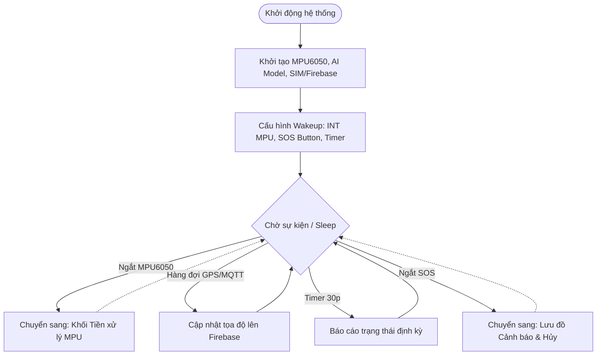
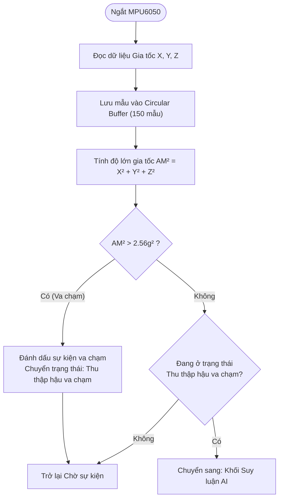
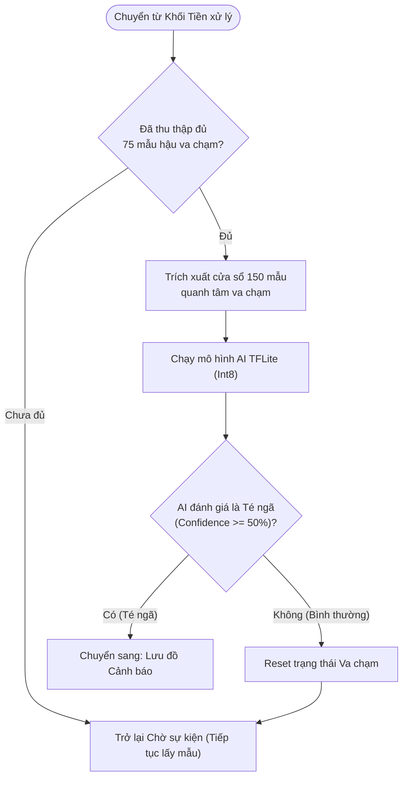
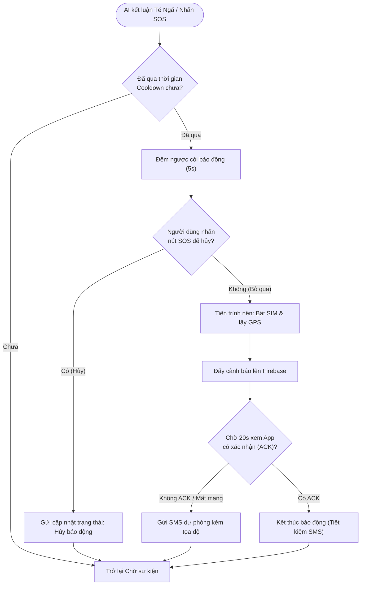

Dưới đây là các lưu đồ hoạt động của hệ thống (Firmware Flowchart) được chia nhỏ theo từng chức năng để tiện theo dõi và đưa vào báo cáo:

### 1. Lưu đồ Hoạt động chính (Main System Flow)
Quản lý trạng thái khởi động, ngủ sâu (Deep Sleep) và đánh thức (Wake-up) bằng các sự kiện khác nhau.

### 2. Khối Tiền xử lý Dữ liệu & Bắt ngưỡng Va chạm (Data Collection & Impact Detection)
Thực hiện đọc MPU6050 liên tục và tính toán Vector gia tốc để phát hiện khoảnh khắc va chạm ban đầu.

### 3. Khối Chạy Suy luận AI & Đánh giá (Window Extraction & AI Inference)
Chờ thu thập đủ các mẫu dữ liệu đệm sau cú ngã để đảm bảo điểm va chạm nằm ở giữa cửa sổ dữ liệu, sau đó đưa vào mạng Neural Network.

### 4. Lưu đồ Xử lý Cảnh báo & Hủy báo động (Alert & Cancellation Logic)
Kích hoạt khi AI xác định té ngã hoặc người dùng chủ động nhấn nút SOS.

